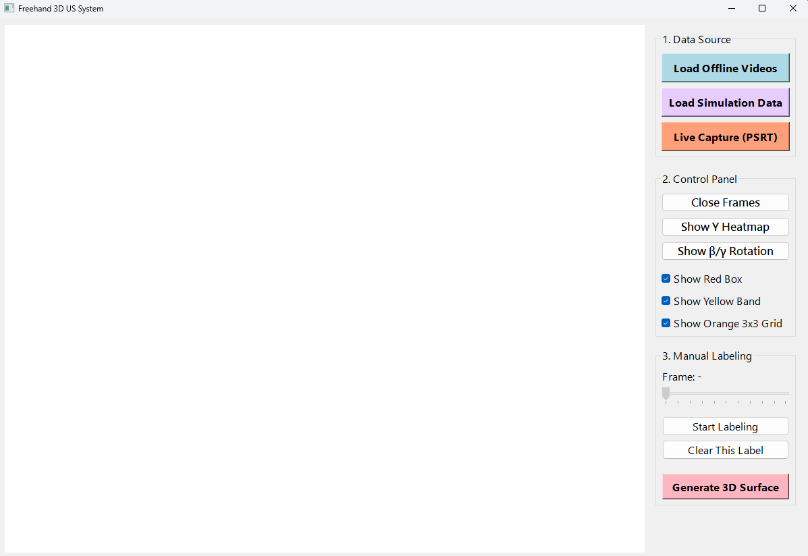
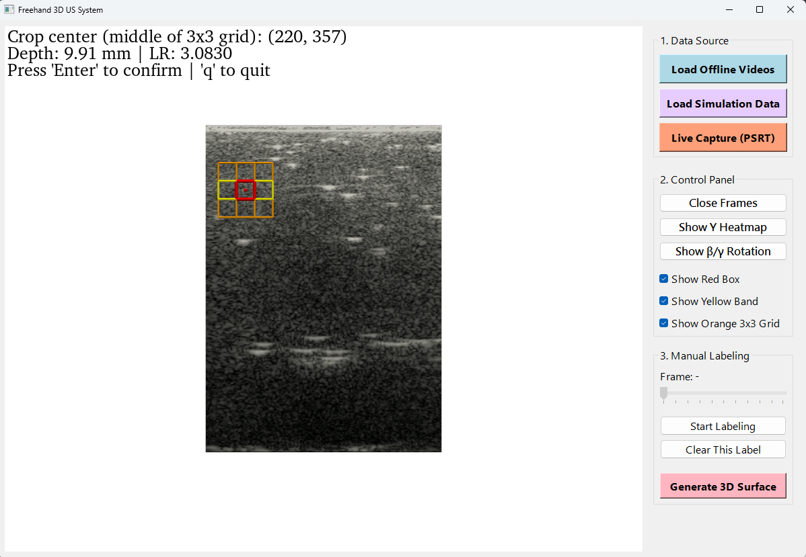
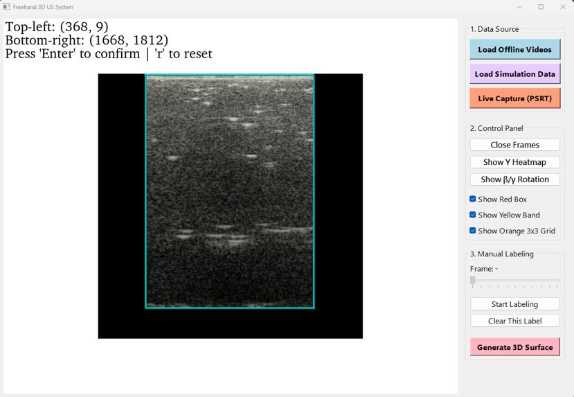
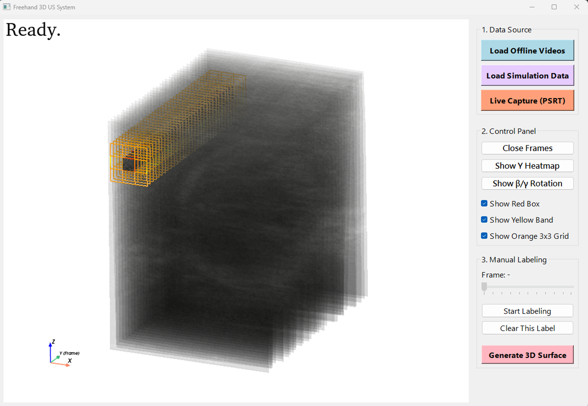
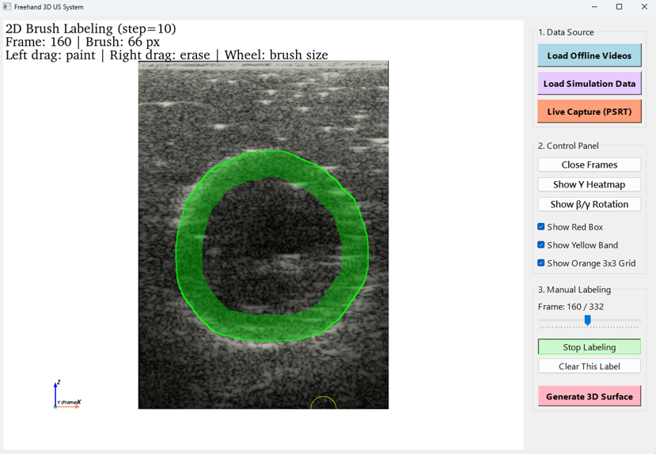
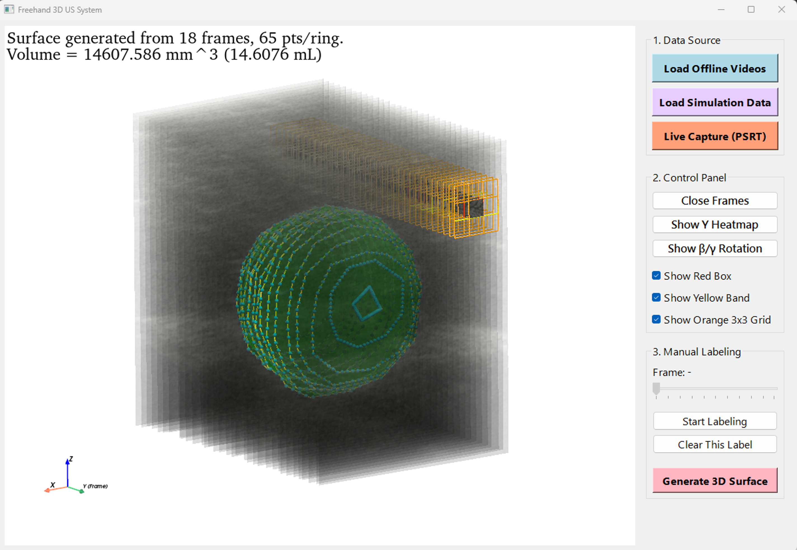

# Freehand 3D Ultrasound Imaging System

A desktop tool for reconstructing and inspecting 3D ultrasound data from synchronized left/right ultrasound image streams. This project is based on a Prodigy ultrasound system and a zipper array transducer. The app provides an interactive PyQt5 + PyVista workflow for loading data, selecting the ultrasound region, stabilizing frames, visualizing stacked 3D slices, labeling contours, and exporting reconstruction results.

For best reconstruction accuracy, the zipper array transducer should be moved slowly and at a steady speed during scanning. Sudden acceleration, pauses, or uneven hand motion can reduce the reliability of frame-to-frame spacing estimation and 3D stacking.


## Quick Start

### 1. Create environment

Python 3.10 is recommended.

```bash
conda create -n freehand3d python=3.10 -y
conda activate freehand3d
pip install --upgrade pip
pip install -r requirements.txt
```

`decord` is optional. If installed, the app will try GPU video decoding first and fall back when needed.

```bash
pip install decord
```

### 2. Run the app

```bash
python main.py
```

The app starts with an empty window and waits for you to choose a data source.



### 3. Choose input data

Use one of the buttons in the right panel:

- `Load Offline Videos`: choose the left-plane video first, then the right-plane video.
- `Load Simulation Data`: choose the left image folder first, then the right image folder.
- `Live Capture (PSRT)`: run the PSRT capture script, then load the captured videos.

For offline video mode, common inputs are `.avi` or `.mp4` files.

## Basic Workflow

1. Select ROI
   - Click the top-left corner of the ultrasound region.
   - Click the bottom-right corner.
   - Press `Enter`.

   

2. Select crop center
   - Click the center of the target crop.
   - The app shows the crop box, 3x3 grid, and middle band.
   - Press `Enter` to start processing.

   

3. Inspect the 3D view
   - Toggle frame, red-box, yellow-band, and grid overlays from the control panel.
   - Use `Show Y Heatmap` to inspect optical-flow matching.
   - Use `Show Beta/Gamma Rotation` to inspect out-of-plane rotation estimates.

   

4. Manual labeling
   - Use the frame slider to choose a frame.
   - Click `Start Labeling`.
   - Draw or edit the contour in the 2D labeling view.
   - Repeat on the frames you want to use.

   

5. Generate result
   - Click `Generate 3D Surface`.
   - The app builds a surface from the labeled contours and reports the estimated volume.

   

## Outputs

Outputs are mainly intended for debugging, experiment records, and downstream analysis.

Each run creates a folder under:

```text
output/<run_name>/
```

Typical outputs include:

- `cropped_frames/` when PNG saving is enabled.
- `stabilized_frames/` when stabilization debug saving is enabled.
- `pred_eval.mat` when evaluation export is enabled.
- plots or intermediate outputs generated from the heatmap and reconstruction tools.

Most output behavior is controlled in `config.py`.

## Important Configuration

Common settings in `config.py`:

- `output_fps`: sampled video FPS used by the app.
- `video_crop_size`: crop box size for offline videos.
- `y_heatmap_max_r_ahead`: optical-flow comparison range, currently set to 50 frames.
- `enable_eval_export`: export `pred_eval.mat` after surface generation.


